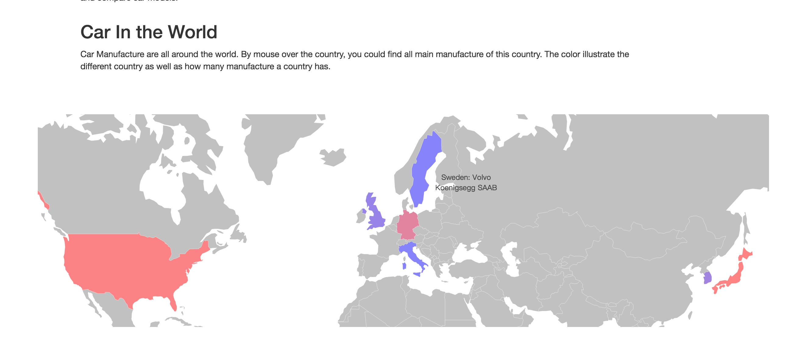
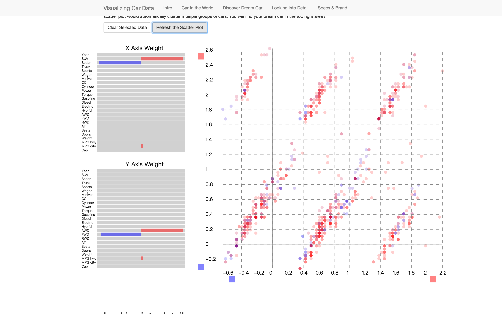
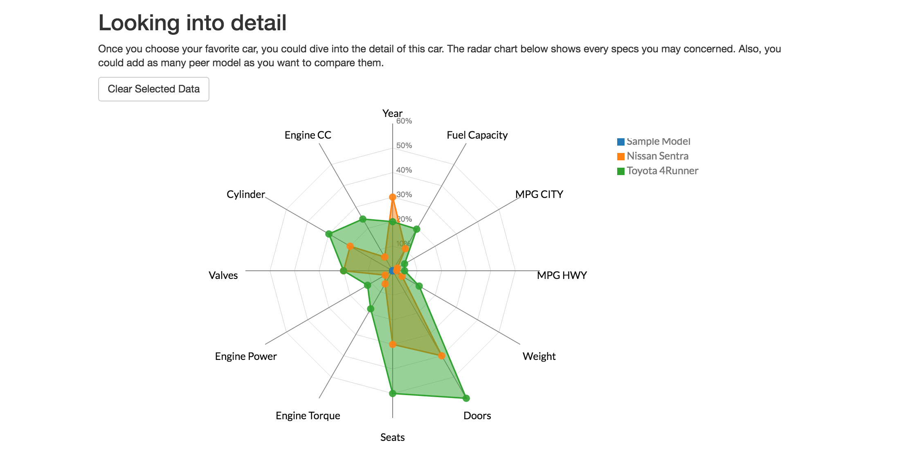
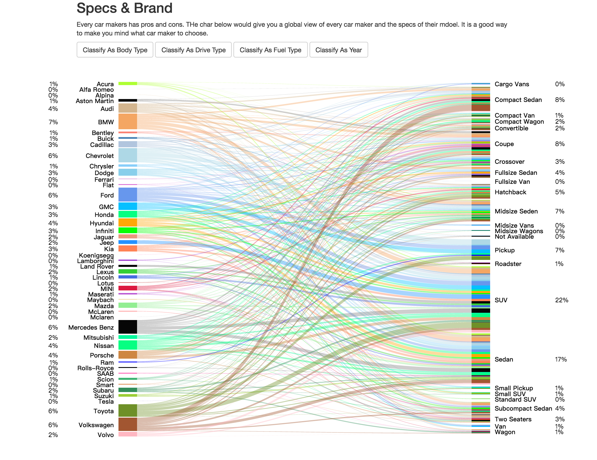

# Final Project - Visualizing Car Data

# Basic Information

Project title: Visualizing Car Data

Team members: 

- Yifei Gao:     ygao5@wpi.edu     GitHub:EFGAO

- Jingjun Zhang: jzhang9@wpi.edu  GitHub:zhangjingjun

- Hongmei Zong: hzong@wpi.edu   GitHub: zonghm

Project link: 
[https://zonghm.github.io/DataVisFinal/index.html]

Screencast video link:

# Overview of Project & Features

Choosing a car is a difficult issue for a lot of people, since there are too many models available. In addition, car model has too many specs to consider. In this data visualization, we attempt to present the car model data in a more intuitive and interactive way in order to help people to discover and compare car models. 

We make four data visualizations totally. Each data visualization has its own functionality and also could interact with other visualizations. 

## Geomap
First, we use the wolld geomap to illustrate the relationship between country and the car makers. It would show a list of car makers of each country when you mouse over the map. Also, if you click the country, the scatter plot in the below would be influenced and only show the models of this country.

 

## InterAxis Plot
The main part of our project is InterAxis Scatter Plot. This idea is inspired by the paper `InterAxis: Steering Scatterplot Axes via Observation-Level Interaction`. We read through the paper and implement the InterAxis by JavaScript in d3.

Basicly, InterAxis Plot has two usages. First, we could select differnt car models (which represented by point in the scatter plot) and assign them to the high end or low end of each axis. 
Then it would automatically generate a new axis which has mixed weight of dimensions value. 

Second, user could adjust the wieght bar manully.  The general idea is that the new axis emphsize the value which has the positive value of the weight bar and de-emphsize the value which has the negative value of the weight bar. 

If a user proper use the two usages below, he could get multiple clusters of point. And the most suitbale car should be found in the top right area. (Since it has the biggest value for both x-axis and y-axis)

## Radar Chart
The radar chart would help user dive into the specific model.
When user click the point in the Inter Axis plot we just mentioned, the full information would be showed in the radar chart. 

It would show 12 sepcs of a model including produced year, engine CC, engine power, engine torque, etc. Also user could easily compare the different models within the radar chart. 

## Bipartite Chart 
Finally, we introduce the bipartite chart (bp chart). Bp chart could show the relationship between car manufacture and car specs. For example, when you mouse over the left bar, you could find out what type of a car the manufactor have. And vice versa, when you mouse over the right bar, you would figure out what car makers would make a specific type of car.

# Visualizations implementation and libraries 
- Implemented Geo Map only with d3 and a json file. 
- Implemented InterAxis Plot only widh d3
- Implemented Radar chart with Library https://github.com/alangrafu/radar-chart-d3
- Implemented BP chart with Library http://vizjs.org/viz.v1.1.0.min.js
- Design the frame work by Bootstrap Library

# Members Contribution

Three of our team members both work closely and independently.

- Jingjun are responsible for the Geomap and InterAxis Plot including the demension reduction algorithm of InterAxis Plot. He also did the work for data preprocessing within the javascript.

 - Hongmei mainly figured out how the Bipartite charts can be used in our design and prepare the data sets using python for the Bipartite charts. She also invloved collecting raw data set from website and writing documentations. 
 
 - Yifei worked on raw data collecting, data processing and cleaning up the data. He used the javascript to access the CarQuery website API and retrive the data. He is also responsible for the radar chart and the frame work of the index.html
 
 

